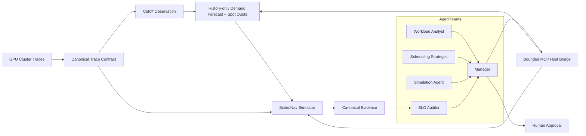

# SchedNav

**Agentic Control Plane for GPU Cluster Scheduling**

[](https://github.com/Hai-qq/SchedNav/actions/workflows/ci.yml)
[](LICENSE)

SchedNav 是一个面向 GPU 集群的多智能体调度决策系统。它内置确定性的离散事件仿真引擎，让 Agent 在真实历史 Trace 上分析负载、提出有边界的高层策略、运行反事实实验、审核 SLO，并根据结构化证据给出可审计建议。

Agent 不直接决定 Job → GPU/Node placement。具体队列推进、抢占、资源核算和节点分配全部由 `schednav-sim` 执行；LLM 只能选择仓库中声明的高层 Policy Action。

仓库中已发布的 V1 实验仍是 historical trace-driven policy optimization。代码同时提供一个只读取决策截止时刻及以前状态的预测控制内环：按租户和 GPU 资源池观测 HP 需求、训练概率模型、生成 Spot 配额并根据真实保障事件反馈调节，可做无未来泄漏的 rolling replay / shadow evaluation；它尚不等同于已经接入真实集群的在线调度系统。

## Why SchedNav

- **内置第一方仿真内核**：核心调度、placement、抢占和指标账本位于 SchedNav 源码中，可直接安装与测试；
- **多数据集入口**：所有数据先转换为统一 Trace Contract，已提供 Alibaba 与 Microsoft Philly 适配器；
- **有限 Action Space**：Agent 不能提交 Job、Node、GPU ID 或任意代码；
- **Simulator-in-the-loop**：候选策略必须在同一 Trace fingerprint 和窗口上真实运行；
- **Tenant-aware predictive loop**：一分钟观测、每日重训、P90 预留、五分钟配额与保障事件反馈全部由第一方确定性代码执行；
- **Hard-SLO-first**：先淘汰违反硬约束的策略，再按显式层级排序，不使用 LLM 自由加权分；
- **结构化证据**：Trace、Policy、SimulationResult、MetricsReport、SLOAudit 和 Ranking 都具有版本化 schema 与 fingerprint；
- **Human approval**：证据无法唯一决胜时保留并列，由人类明确批准。

## Architecture



```text
Trace Window
  → Workload Analysis
  → 3–5 Bounded Policy Actions
  → Isolated Counterfactual Simulations
  → Canonical Metrics
  → Hard-SLO Audit
  → Hierarchical Ranking
  → Recommendation / Human Approval
```

预测控制模式则在每个滚动截止时刻重复 `按租户/资源池观测当前状态 → 预测未来 HP 需求分布 → 计算 Spot 配额 → 由 simulator 执行 → 用已发生的保障事件反馈`。预测器看不到截止时刻后的 Job；未来真实值只会在到达后用于事后评分。

## Built-in simulator

`schednav-sim` 当前支持：

- 异构节点与 GPU model affinity；
- 整卡或 fractional GPU demand；
- FIFO 与 HP-first preemptive policy；
- Spot 保障边界、checkpoint rollback 和抢占 overhead；
- HP 抢占延迟与同时约束全量/评估人口的 Spot eviction budget；
- 可选的 longest-remaining / lowest-checkpoint-loss 抢占受害者规则；
- 仅基于历史观测、按租户和 GPU 资源池拆分的 HP 概率预测，P90 容量预留与按保障时长计算的 Spot quota；
- 每分钟需求观测、每 5 分钟 quota 更新、每日 warm-start 重训，以及基于保障周期完成/作业完成/抢占事件的有界 \(\eta\) 反馈；
- deterministic best-fit 多节点 allocation；
- drain-to-completion；
- Job、Spot run、guarantee 和 preemption 事件账本；
- allocation、JCT、queue、eviction 和 guarantee metrics。

placement 策略固定在引擎内部，不属于 Agent Action Space。完整语义和限制见 [SchedNav Simulator](docs/native-simulator.md) 与 [Predictive Spot Control](docs/predictive-control.md)。

## Dataset support

所有数据源都转换为 `schednav.trace/v1` 或带租户维度的 `schednav.trace/v2`：

```text
trace.json     # 来源、版本、过滤条件、文件 hash、trace fingerprint
nodes.csv      # node_id, gpu_model, gpu_count
jobs.csv       # job_id, submit, duration, GPU demand, HP/Spot, gpu_model[, tenant_id]
```

当前适配器：

| Dataset | Command | Notes |
|---|---|---|
| Alibaba Spot GPU Trace | `schednav import-alibaba` | 保留原始 HP/Spot 标签，将 `organization` 映射为 `tenant_id`，支持 GPU model 与 arrival cutoff。 |
| Alibaba GPU Trace v2023 | `schednav import-alibaba-v2023` | 使用源数据 LS/BE QoS 显式映射 HP/Spot，保留 fractional GPU 与 phase provenance。 |
| Microsoft Philly GPU Trace | `schednav import-philly` | 官方数据没有 HP/Spot 标签，调用者必须显式声明映射并写入 provenance。 |
| 其他公开或私有 Trace | Canonical adapter contract | 只需生成统一的三文件合同，无需修改仿真器。 |

原始数据和逐 Job 转换结果均保留在仓库外。详见 [Trace Contract](docs/trace-contract.md) 与 [Dataset Support](docs/datasets.md)。

## Core agents

| Component | Responsibility |
|---|---|
| Workload Analyst | 汇总 HP/Spot 到达、GPU demand、carry-in 与 workload regime；滚动模式只基于 cutoff 以前的观测生成需求预测。 |
| Scheduling Strategist | 从有限 Action Space 中生成 3–5 个可执行策略，并引用已登记的预测控制器。 |
| Simulation Agent | 在隔离状态下执行同窗 counterfactual simulation 或逐时刻预测控制 replay。 |
| SLO Auditor | 审核完成率、JCT、排队、eviction、保障率和 allocation rate。 |
| Manager | 拆解任务、传递结构化 artifact、汇总证据并管理 human approval。 |
| Host bridge | 暴露白名单操作，不向 Agent 提供任意 shell 或 placement 接口。 |

## Quick start

```powershell
git clone https://github.com/Hai-qq/SchedNav.git
cd SchedNav
py -3.11 -m venv .venv
.\.venv\Scripts\python.exe -m pip install -e .
$env:PYTHONPATH = (Resolve-Path .\src).Path
.\.venv\Scripts\python.exe -m unittest discover -s tests -v
```

需要可训练的按租户预测器时，安装可选依赖：

```powershell
.\.venv\Scripts\python.exe -m pip install -e ".[forecast]"
# 或首次初始化时：.\scripts\setup_runtime.ps1 -Forecast
```

转换一个本地 Trace：

```powershell
schednav import-alibaba `
  --node-info C:\datasets\gpu-trace\node_info_df.csv `
  --job-info C:\datasets\gpu-trace\job_info_df.csv `
  --output-dir C:\datasets\schednav\gpu-series-2-window `
  --gpu-model GPU-series-2 `
  --evaluation-start-seconds 3628800 `
  --evaluation-end-seconds 3715199 `
  --exclude-warmup-spot
```

运行内置 simulator：

```powershell
schednav simulate `
  --trace C:\datasets\schednav\a100-day1\trace.json `
  --policy configs\policies\native-fifo.json `
  --result C:\datasets\schednav\fifo-result.json `
  --metrics C:\datasets\schednav\fifo-metrics.json
```

在某个决策截止时刻生成不含未来 Job 的预测输入与配额：

```powershell
schednav forecast-demand `
  --trace C:\datasets\schednav\a100-day1\trace.json `
  --controller configs\controllers\tenant-predictive-spot-v1.json `
  --cutoff-seconds 3628800 `
  --output C:\datasets\schednav\forecast.json
```

运行逐时刻预测控制 replay：

```powershell
schednav simulate-predictive `
  --trace C:\datasets\schednav\a100-day1\trace.json `
  --policy configs\policies\native-preemptive-g3600-b09-d0000.json `
  --controller configs\controllers\tenant-predictive-spot-v1.json `
  --result C:\datasets\schednav\predictive-result.json `
  --metrics C:\datasets\schednav\predictive-metrics.json
```

同一个 Trace 可分别运行所选 Action Space 声明的有限策略，再交给 compare、SLO audit 与 ranking 命令处理。

## Multi-dataset validation

第一方内核已在两个数据提供方、三个真实 GPU Trace 版本上运行。[Alibaba 12-window v2 evaluation](evidence/native-v2/alibaba-gpu-series-2-multiwindow-30d-v2.json) 固化了 12 个预先分层窗口、5 个策略、每策略每窗口 2 次重复，共 120 次确定性仿真的汇总证据；[Alibaba v2023 QoS receipt](evidence/native-v2/alibaba-gpu-v2023-qos-full.json) 验证了第二套源生服务等级语义、fractional GPU、仿真、SLO 与并列保留；[Alibaba mixed HP/Spot policy evaluation](evidence/native-v1/alibaba-gpu-series-2-2024-04-12-policy-evaluation.json) 记录了一个带 warm-up carry-in 的代表性窗口；[Philly validation receipt](evidence/native-v1/philly-validation.json) 验证了另一提供方的 ingestion 与确定性。

该 Philly 验证只覆盖 ingestion、placement、completion、JCT、allocation 和 determinism。由于源数据没有 HP/Spot 标签，Spot eviction、guarantee 和 HP-vs-Spot SLO 明确保持未验证。

代表性 Alibaba 窗口的四个策略全部通过 8 项硬 SLO。三个抢占策略达到 80% allocation 软目标，但在严格 1 个百分点 allocation tie band 内，且 Spot p95 JCT 与 eviction rate 相同，因此结果保持 `tie_requires_human_approval`，未添加隐藏的第四排序指标。

可训练的 tenant-predictive 路径也已在真实 `GPU-series-2` trace/v2 窗口上重复两次：两个 cutoff forecast 以及两组完整 result/metrics 分别同哈希。该控制器通过 7/8 项硬 SLO，但 allocation 为 75.30%，低于兼容 FIFO 的 76.40%，因此被硬约束淘汰。这个[精简证据回执](evidence/predictive-v1/alibaba-gpu-series-2-2024-04-12-tenant-predictive.json)证明预测、quota、反馈、仿真与审计链路可执行且可复现，不证明性能优于 FIFO。

多窗口结果更接近真实结论：每个窗口先过 8 项硬 SLO，再按 allocation → Spot p95 JCT → eviction 分层决策，保留并列和无合格策略状态。12 窗口 v2 研究用于策略保护机制对比；当前 v3 进一步覆盖全部 112 个合格窗口，并采用 67/45 的时间顺序 calibration/holdout 切分。

在 45 个 holdout 窗口中，FIFO/校准集最佳固定策略只在 40 个窗口通过全部硬 SLO。AgentTeams 候选控制器在 41 个窗口找到合格策略，并以 185 个候选评估在 41/41 个可行窗口覆盖至少一个五动作正式分层最优动作；其待人工裁决前沿相对 FIFO 的平均 allocation uplift 为 +0.209～+0.257 个百分点。三候选 workload rule 使用 135 个评估并覆盖 39/41 个正式前沿，穷举目录则需要 225 个评估。候选搜索质量与仿真成本会同时报告，完整方法、限制与 fingerprint 见 [Adaptive Holdout Evaluation](docs/adaptive-holdout-evaluation.md)。

单窗口演示可用 `scripts/run_demo_experiment.ps1` 一次执行。多窗口研究使用 `scripts/run_multiwindow_experiment.py` 完成预仿真选窗、限定策略双次运行、同窗 FIFO baseline、SLO 审计与分层排名。已有 AgentTeams controller 时，`scripts/run_adaptive_demo.ps1` 可一次完成冻结设计、全 112 窗口实验、holdout 对照和公开回执。所有脚本都要求单独下载数据，并拒绝覆盖已有输出路径。

## AgentTeams integration

SchedNav 映射为 1 个 Manager + 4 个 Worker，并通过受限 MCP bridge 调用单窗、注册 run-set 或预测控制模式的观测、仿真、比较、审计与排名操作。模型 ID 固定为 `deepseek-v4-flash`。预测控制专用 bridge 配置只开放 `forecast_demand`、`simulate_predictive_policy` 和证据消费操作，不向 Agent 开放会读取完整未来窗口的历史分析接口。

真实 `native-local` 流程已由四个 Worker 完成负载分析、限定策略选择、四次独立仿真与四次 SLO 审计，再由 Manager 调用比较和排名工具。最终项目状态为 `completed / approval_pending`，与公开实验回执一致地停在三策略人工审批门。

注册 run-set 的 `alibaba-v2-12d` 流程也已由同一拓扑完成：12 窗口负载分析、5 个注册动作确认、120 次确定性仿真、逐窗口八项硬 SLO 审计和 Manager 汇总。结果为 2 个唯一选择、9 个并列和 1 个无合格策略；项目状态为 `completed / approval_pending`，没有自动批准跨窗口通用策略。

自适应 holdout 项目 `proj-20260809-080145` 在任何 v3 仿真前冻结了 45 个评估窗口的候选集合。Workload Analyst 验证设计，Scheduling Strategist 使用 `deepseek-v4-flash` 为每窗选择 3–5 个有界动作，Manager 验证覆盖和动作合法性；正式 simulator 随后完成 1,120 次运行并生成独立 holdout 证据。项目保留 `approval_pending`，没有让 Agent 直接批准部署策略。

预测控制 shadow 项目 `proj-20260809-110524` 也已由同一拓扑完整跑通：在 `cutoff_seconds=3628800` 生成不含未来 Job 的预测观测，核验 3 个有界候选，完成 3 次 fixed-policy predictive replay、3 次相对普通 FIFO 的 SLO 审计，再由 Manager 调用确定性的比较与排名工具。三个候选均通过 7/8 项硬约束，但 allocation rate 为 73.52%～73.76%，低于同窗普通 FIFO 的 79.05%，因此项目如实结束为 `completed / no_eligible_policy`。这是依赖较少的 aggregate controller 的 AgentTeams 协同证据；当前 tenant-aware controller 已通过同一 `forecast_demand` / `simulate_predictive_policy` 白名单接口和 `tenant-predictive-local` 运行配置接入，并用单独 trace/v2 回执验证。两次研究的 Trace fingerprint 不同，不做横向性能比较。

```powershell
$env:PYTHONPATH = (Resolve-Path .\src).Path
python .\scripts\build_agentteams_bundle.py --project-root .
```

角色、上下文传递、权限和 human approval 映射见 [AgentTeams Integration](docs/agentteams-integration.md)。

## Repository layout

| Path | Purpose |
|---|---|
| `.codex/` | 可复用的负载分析、策略、仿真、比较和 SLO Skills。 |
| `.github/` | GitHub Actions 边界检查和测试。 |
| `configs/` | 有限策略、预测控制器、Action Space、SLO 和 AgentTeams 配置。 |
| `docs/` | Trace、仿真器、策略合同、SLO 与集成文档。 |
| `evidence/` | 可公开的最小结构化实验汇总，不包含原始 Trace。 |
| `integrations/` | AgentTeams 角色 package 与资源模板。 |
| `patches/` | 仍需单独保留许可证的外部兼容材料。 |
| `schemas/` | Trace、Policy、预测控制、Metrics、SLO 和 Ranking JSON Schema。 |
| `scripts/` | 环境、AgentTeams bundle、host bridge 与公开边界工具。 |
| `src/` | SchedNav 第一方 Python 源码与内置 simulator。 |
| `tests/` | 第一方单元、确定性、安全和合同测试。 |
| `third_party/` | 固定外部版本、来源和许可证；不包含上游源码树或数据。 |
| `.gitattributes` | 跨平台文本与换行规则。 |
| `.gitignore` | 排除数据、凭据、运行结果、虚拟环境和缓存。 |
| `AGENTS.md` | 开发边界和 AI coding agent 约束。 |
| `LICENSE` | SchedNav 第一方代码与文档的 MIT License。 |
| `pyproject.toml` | Python 包、构建与命令行入口。 |
| `README.md` | 项目首页。 |
| `THIRD_PARTY_NOTICES.md` | 外部来源、许可证和 MIT 适用边界。 |

`.git/` 是本地 Git 元数据；`build/`、`dist/`、`*.egg-info/` 和 `__pycache__/` 是被忽略的生成目录。

## Scope

- 已发布的 V1 证据是历史 Trace 上的反事实策略优化；
- 预测控制内环支持按租户/资源池的 cutoff-safe 训练、概率预测、quota、反馈与 rolling replay / shadow evaluation，但尚无真实集群 adapter、在线部署或外层滚动策略切换的生产证明；
- 不引入 RL；
- 不让 LLM 决定细粒度 placement；
- 不跨不同 Trace 直接比较绝对指标；
- 不把缺失的数据标签或 SLO 指标补造成实验事实；
- 性能结论必须来自同窗、同人口、同执行控制的实际 simulation。

## License

SchedNav 第一方代码与文档采用 [MIT License](LICENSE)。数据集、AgentTeams 以及仍保留的兼容材料遵循各自许可证；根目录 MIT 不会重新许可第三方内容。详见 [Third-party Notices](THIRD_PARTY_NOTICES.md)。
