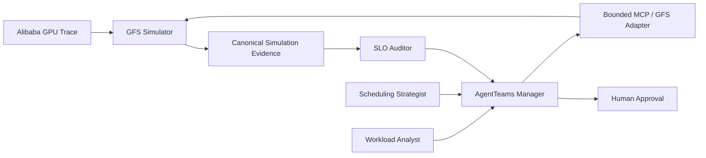

# SchedNav

**比赛中文名：** 智算领航：面向 GPU 集群的多智能体算力调度决策系统  
**开源项目名：** SchedNav  
**英文定位：** SchedNav — Agentic Control Plane for GPU Cluster Scheduling

SchedNav 参加世界人工智能开源大赛的 [Agent Infra 新智基座赛道](https://goaihz.com/tracks?track=infra)。V1 聚焦历史 Trace 驱动的 GPU 调度策略优化：以 GFS simulator 为唯一细粒度 placement 执行器，Agent 只负责负载分析、高层策略生成、仿真编排、SLO 审计和证据汇总。

## 架构



Agent 只能选择白名单中的高层策略参数；具体 Job → GPU/Node placement 始终由 GFS 完成。任何推荐都必须经过同一真实 Trace Window 的 counterfactual simulation 和 SLO gate。

## 当前状态

- 已固定 GFS 上游 commit `e998d5453e626a0b743b3fd5137c54c987db780b`；
- 已 sparse checkout Alibaba `cluster-trace-v2026-spot-gpu`，clusterdata commit `0d0f3f1efdbf1add6a7bcc63676eafbd1eb11f71`；
- 已验证真实 Trace 的 lifecycle/recorder smoke run；
- 已通过 A800 真实 golden window 的 deterministic reproduction gate：两个隔离进程分别训练 estimator，4 个 GFS CSV 的 SHA-256 全部一致；
- 已在 `GPU-series-2 / 2024-04-12` 完成 repository-default `fifo_spot` 与 `spot_scheduler` 双运行：每个 profile 的 job、三类 event ledger、cluster sequence、Spot quota 和 VC record 七类 CSV 均逐字节可重复；
- 已建立结构化 preemption、Spot run-start 与 Spot guarantee 三类事件账本；default GFS 的正式 eviction rate 为 `2/86 = 2.33%`，保障兑现率为 `401/403 = 99.50%`，并记录 3,304 秒 rollback、80 秒 overhead 和 226,728 requested-GPU-seconds 新增工作量；
- 已完成 4 个有界高层策略的真实同窗 portfolio 与 `SchedNav Demo SLO v1` 审计：4 个候选均通过全部硬约束；三个 GFS quantile 在声明的三层排名指标上完全相同，结果为 `tie_requires_human_approval`；
- 0.80 / 0.90 / 0.95 的 Spot quota CSV 不同，但该窗口的 job、三类 event、cluster 与 VC evidence 以及排名指标相同；当前证据不支持宣称某个 quantile 更好；
- 官方全量 `spot_scheduler` 月度 baseline 尚未跑通：compatibility patch 已解决启动契约与 Windows checkpoint 阻塞，但全量运行仍受 per-second queue 扫描开销限制；
- 已实现 workload analysis、有限 action materialization、隔离 simulation、canonical metrics、两两/portfolio comparison、SLO audit、分层 ranking 和 5 个项目 Skill；
- 已部署 AgentTeams `v1.2.1` embedded runtime：Controller 与 CoPaw Manager 均为 `Running`、重启次数为 0，Manager 状态为 `welcomeSent=true`；实际模型固定为 `deepseek-v4-flash`，经 AgentTeams/Higress Gateway 最小聊天请求验证；
- 已用 `deepseek-v4-flash` 构建 1 个 Manager + 4 个 Worker 的 deterministic AgentTeams bundle；构建器会拒绝其他 model ID，生成物保持在被忽略的 `dist/agentteams/`；
- 已实现带 AgentTeams Gateway 委托认证的受限 MCP host bridge；它只暴露白名单 SchedNav 操作、结构化 artifact 读取、幂等任务提交和单执行通道，不向容器开放任意 shell；
- 已提供无凭据的一键前台启动与安全验证脚本；独立端口启动/停止已验证，越界参数、未登记 action、未知 SLO、缺失/无效认证和不可用 bridge 均 fail closed；
- Workload Analyst、Scheduling Strategist、Simulation Agent、SLO Auditor 四个 standalone Worker 均已部署为 `Running`，且模型全部锁定为 `deepseek-v4-flash`；真实 Workload Worker → MCP → Windows host → Alibaba Trace 链路已经成功产出并回读 `schednav.workload-summary/v1`；
- Manager 已完成 finite project `proj-20260808-060606` 的四阶段协作：四个领域任务均已归档，官方 `state.json` 无活动任务；全程未调用 `simulate_policy`、未启动新 GFS run，最终确定性 ranking 为 `tie_requires_human_approval`；
- 首轮计划批准与最终接受均已写入 Matrix/MinIO 审计链；Admin 在三方证据并列后人工接受 `repository-default-gfs`，项目 outcome 已收敛为 `accepted`；该选择明确不代表它在现有证据上优于 0.80/0.95；
- 当前公开仓库只包含 SchedNav 第一方实现、最小结构化 Demo 证据、第三方来源/许可证和 compatibility patch；不包含第三方源码树、原始 Trace 或运行现场。

完整源码审计与 V1 建议见 [docs/gfs-baseline-audit.md](docs/gfs-baseline-audit.md)；正式 SLO 见 [docs/schednav-demo-slo-v1.md](docs/schednav-demo-slo-v1.md)；策略执行与证据合同见 [docs/policy-evaluation-contract.md](docs/policy-evaluation-contract.md)；AgentTeams 映射见 [docs/agentteams-integration.md](docs/agentteams-integration.md)。

## 仓库结构

这个目录就是可公开的 SchedNav 项目边界：

```text
src/schednav/    # 第一方 adapter、metrics、comparison 与 SLO audit
configs/         # 可执行且有边界的实验配置
schemas/         # Trace/Run/Metrics/SLO/Ranking JSON Schema
patches/         # 版本化的最小 GFS / AgentTeams compatibility patch
integrations/    # AgentTeams 角色 package 与资源模板
.codex/skills/   # 五个可复用 SchedNav Skills
scripts/         # AgentTeams bundle 与 host bridge 工具
tests/           # 第一方确定性、边界与合同测试
docs/            # 项目分析与设计事实
evidence/demo-v1/# 可公开的最小结构化指标、审计与排名证据
third_party/     # 固定版本、归属和第三方许可证
```

GFS 与 Alibaba Trace 必须按 `third_party/manifest.json` 的固定 commit 另行获取，并放在仓库根目录约定的位置；它们被 `.gitignore` 明确排除。

## 本地验证

第一方合同测试只使用 Python 标准库，不需要下载 GFS 或 Trace：

```powershell
py -3.11 -m venv .venv
.\.venv\Scripts\python.exe -m pip install -e .
$env:PYTHONPATH = (Resolve-Path .\src).Path
.\.venv\Scripts\python.exe -m unittest discover -s tests -v
```

真实 simulation 的上游 checkout、Python 环境和 compatibility patch 步骤见 [本地准备](docs/getting-started.md)，完整 gate 命令见 [复现合同](docs/reproduction-contract.md)。

## Host bridge 启动与安全检查

launcher 不读取或保存 DeepSeek Key，只把 Worker 携带的 bearer identity 委托给本机 AgentTeams Gateway 校验。默认以前台方式运行，关闭终端即停止：

```powershell
.\scripts\setup_gfs_runtime.ps1
.\scripts\start_host_bridge.ps1
```

只检查已有服务，或运行可重复的安全失败演示：

```powershell
.\scripts\start_host_bridge.ps1 -CheckOnly
.\scripts\test_host_bridge_safety.ps1
```

## Demo Evidence

[`evidence/demo-v1/`](evidence/demo-v1/) 保存当前 Trace Window 的 MetricsReport、SLO audit、portfolio、ranking 和 workload summary。它不包含逐 Job CSV、原始 Trace、日志或 checkpoint；证据边界与文件映射见 [evidence/demo-v1/README.md](evidence/demo-v1/README.md)。

## 开源边界

公开仓库只发布 SchedNav 自研内容、最小结构化结果和依法保留的第三方归属/许可证。以下内容仅作为本地依赖或实验输入，不进入版本库：

- `26ASPLOS-Spot/`：GFS 上游基座；
- `clusterdata/` 及任何 Alibaba GPU Trace 原始 CSV 或逐 Job 派生数据；
- `.venv-gfs/`、模型 checkpoint、日志、缓存与 `artifacts/` 运行产物；
- 密钥、令牌、Cookie、私有配置或其他凭据。

第三方项目使用固定 commit、来源链接、compatibility patch 和许可证文本声明，不复制其源码树。详见 [THIRD_PARTY_NOTICES.md](THIRD_PARTY_NOTICES.md)。SchedNav 第一方代码的开源许可证仍待项目方最终选择；在确定前不对第三方授予额外许可。
