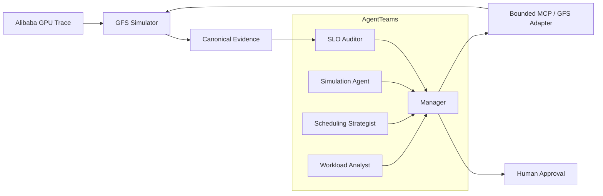

# SchedNav

**Agentic Control Plane for GPU Cluster Scheduling**

[](https://github.com/Hai-qq/SchedNav/actions/workflows/ci.yml)
[](LICENSE)

SchedNav 是构建在 GPU 集群调度器之上的多智能体决策控制层。它不替代底层 scheduler，也不让大模型直接决定 Job → GPU/Node placement；Agent 只负责分析负载、提出有边界的高层策略、编排反事实仿真、审核 SLO，并根据真实仿真证据给出可审计的建议。

当前 V1 面向历史 Trace 驱动的策略优化：使用固定的真实 Trace Window 比较多个候选策略。它不是在线调度系统，也不会把历史 Trace 中的未来信息包装成在线预测能力。

## Why SchedNav

传统 GPU scheduler 擅长执行具体 placement，但跨时间窗口的负载判断、策略组合、实验编排和 SLO 解释通常分散在脚本与人工流程中。SchedNav 把这些工作组织成一个受控决策闭环：

- **LLM 不做细粒度 placement**：具体 GPU/Node 分配始终由 GFS 完成；
- **策略空间有明确边界**：Agent 只能选择预先声明并可转换为 GFS 配置的 action；
- **结论必须由 Simulator 支撑**：未经同窗反事实仿真的策略不能进入推荐；
- **SLO 先于优化目标**：先淘汰违反硬约束的方案，再按公开的分层规则排序；
- **关键数据结构化传递**：RunSpec、MetricsReport、SLOAudit、PolicyRanking 等都具有版本化 schema 和 fingerprint；
- **Human-in-the-loop**：证据无法唯一决胜时保留并列，由人类明确批准，不允许 LLM 自造权重或隐藏 tie-breaker。

## Architecture



端到端流程为：

```text
Trace Window
  → Workload Analysis
  → 3–5 Bounded Policy Actions
  → Isolated GFS Simulations
  → Canonical Metrics
  → Hard-SLO Audit
  → Hierarchical Ranking
  → Recommendation / Human Approval
```

## Core components

| Component | Responsibility |
|---|---|
| Workload Analyst | 汇总 HP/Spot 到达、GPU demand、carry-in 与 workload regime，不生成 placement。 |
| Scheduling Strategist | 从白名单 action space 中生成 3–5 个可执行高层策略。 |
| Simulation Agent | 将候选 action materialize 为 GFS RunSpec，并隔离运行 counterfactual simulation。 |
| SLO Auditor | 从 canonical MetricsReport 审核完成率、JCT、排队、eviction、保障率和 allocation rate。 |
| Manager | 拆解任务、传递结构化 artifact、汇总证据并管理 human approval。 |
| Host bridge | 以受限 MCP 接口连接 AgentTeams 与本机 GFS；不向 Agent 暴露任意 shell。 |

## Repository layout

下面逐项说明 GitHub 根目录中的全部受版本控制内容：

| Path | Purpose |
|---|---|
| `.codex/` | 五个可复用 SchedNav Skills：负载分析、策略选择、仿真、策略比较和 SLO 审计。 |
| `.github/` | GitHub Actions 工作流；当前在 Windows/Python 3.11 上运行公开边界检查和第一方合同测试。 |
| `configs/` | 可执行配置，包括 Trace Window、GFS baseline、候选 action、action space、SLO 和 AgentTeams identity/bridge 配置。 |
| `docs/` | 架构与运行文档，包括 GFS 源码审计、复现合同、策略评估合同、SLO 定义和 AgentTeams 集成。 |
| `evidence/` | 可公开的最小结构化 Demo 证据：MetricsReport、SLO audit、portfolio、ranking 和 workload summary；不含原始或逐 Job Trace。 |
| `integrations/` | AgentTeams 五角色 package manifest 与资源模板。 |
| `patches/` | 对固定版本 GFS 和 AgentTeams 的最小 compatibility patch，以及对应应用说明。 |
| `schemas/` | RunSpec、MetricsReport、PolicyAction、SLOAudit、PolicyRanking 等 JSON Schema。 |
| `scripts/` | GFS 环境准备、AgentTeams package 构建、host bridge 启动/安全演示和公开仓库边界检查脚本。 |
| `src/` | SchedNav Python 源码：adapter、action materialization、metrics、comparison、ranking、SLO 和 MCP host bridge。 |
| `tests/` | 不依赖原始 GFS/Trace 的第一方单元与合同测试。 |
| `third_party/` | 固定的上游版本清单及 GFS/AgentTeams 许可证文本；不包含上游源码树。 |
| `.gitattributes` | 统一 Git 文本文件与跨平台换行规则。 |
| `.gitignore` | 阻止上游源码、Trace、虚拟环境、凭据、运行产物和缓存进入仓库。 |
| `AGENTS.md` | 面向 AI coding agent 和贡献流程的项目约束；不是运行时代码。 |
| `LICENSE` | SchedNav 第一方代码的 MIT License。 |
| `pyproject.toml` | Python 包元数据、构建配置和 `schednav-reproduce` / `schednav-bridge` 命令入口。 |
| `README.md` | 项目首页与快速导航，即当前文件。 |
| `requirements-local.txt` | 运行固定 GFS simulator 所需的 Python 3.11 依赖版本；第一方合同测试本身不依赖这些重型组件。 |
| `THIRD_PARTY_NOTICES.md` | 第三方来源、版本、许可证和 MIT 不适用范围的人工可读说明。 |

本地 clone 后还会出现 `.git/`，它只是 Git 内部元数据，不属于仓库内容。构建产生的 `build/`、`dist/`、`*.egg-info/`、`__pycache__/` 等目录均被忽略。

## Quick start

第一方合同测试不需要下载 GFS 或 Alibaba Trace：

```powershell
git clone https://github.com/Hai-qq/SchedNav.git
cd SchedNav
py -3.11 -m venv .venv
.\.venv\Scripts\python.exe -m pip install -e .
$env:PYTHONPATH = (Resolve-Path .\src).Path
.\.venv\Scripts\python.exe -m unittest discover -s tests -v
```

检查当前工作树是否满足公开边界：

```powershell
.\scripts\check_public_boundary.ps1
```

## Run with GFS

真实 simulation 需要单独获取固定版本的 GFS 和 Alibaba GPU Trace，并应用版本化 compatibility patch：

```powershell
.\scripts\setup_gfs_runtime.ps1
$env:PYTHONPATH = (Resolve-Path .\src).Path
.\.venv-gfs\Scripts\python.exe -m schednav.cli validate `
  --config configs\baselines\stress-gpu-series-2-2024-04-12.json
```

完整 checkout、sparse Trace 获取和 patch 步骤见 [Getting Started](docs/getting-started.md)，确定性 gate 与 MetricsReport 生成命令见 [Reproduction Contract](docs/reproduction-contract.md)。

## AgentTeams integration

构建锁定为 `deepseek-v4-flash` 的 1 Manager + 4 Worker package：

```powershell
$env:PYTHONPATH = (Resolve-Path .\src).Path
.\.venv-gfs\Scripts\python.exe .\scripts\build_agentteams_bundle.py --project-root .
```

角色、上下文传递、MCP 权限和 human approval 映射见 [AgentTeams Integration](docs/agentteams-integration.md)。AgentTeams 本身是独立部署依赖，不包含在本仓库中。

## Evidence

[`evidence/demo-v1/`](evidence/demo-v1/) 保存一个真实 Trace Window 的最小、可公开证据。当前结果显示：FIFO 与三个 GFS quantile 都通过已声明的硬 SLO；三个 GFS quantile 在 allocation rate、Spot p95 JCT 和 eviction rate 上并列，因此结果保持 `tie_requires_human_approval`，不宣称 0.80、0.90 或 0.95 中任何一个更优。

所有结果都来自固定 GFS/Trace 版本和同窗 simulation。原始 Trace、逐 Job CSV、日志与 checkpoint 不进入仓库。

## Scope and limitations

- V1 是 historical trace-driven policy optimization，不是 online scheduling；
- GFS 保留全部细粒度 placement 权限；
- policy action 必须经过白名单校验并转换为可执行 RunSpec；
- 排名采用 hard-SLO-first 的分层规则，不使用 LLM 自由加权综合分；
- 当前完整月度 `spot_scheduler` baseline 仍受上游 per-second queue 扫描开销限制；
- 公开 evidence 是最小结构化结果，不替代获取原始 Trace 后的独立复现。

## Documentation

- [Getting Started](docs/getting-started.md)
- [GFS Baseline Audit](docs/gfs-baseline-audit.md)
- [Reproduction Contract](docs/reproduction-contract.md)
- [Policy Evaluation Contract](docs/policy-evaluation-contract.md)
- [SchedNav Demo SLO v1](docs/schednav-demo-slo-v1.md)
- [AgentTeams Integration](docs/agentteams-integration.md)
- [Third-party Notices](THIRD_PARTY_NOTICES.md)

## License

SchedNav 第一方代码采用 [MIT License](LICENSE)。GFS compatibility patch、AgentTeams compatibility patch 和第三方许可证文本继续分别受其上游 GPL-3.0-only、Apache-2.0 等条款约束；根目录 MIT 不会重新许可这些第三方材料。
