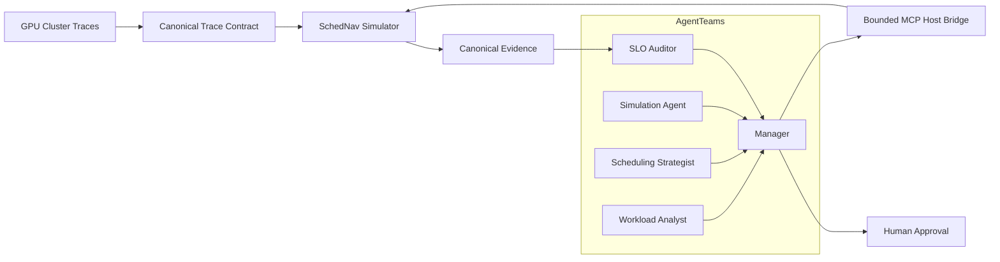

# SchedNav

**Agentic Control Plane for GPU Cluster Scheduling**

[](https://github.com/Hai-qq/SchedNav/actions/workflows/ci.yml)
[](LICENSE)

SchedNav 是一个面向 GPU 集群的多智能体调度决策系统。它内置确定性的离散事件仿真引擎，让 Agent 在真实历史 Trace 上分析负载、提出有边界的高层策略、运行反事实实验、审核 SLO，并根据结构化证据给出可审计建议。

Agent 不直接决定 Job → GPU/Node placement。具体队列推进、抢占、资源核算和节点分配全部由 `schednav-sim` 执行；LLM 只能选择仓库中声明的高层 Policy Action。

当前 V1 是 historical trace-driven policy optimization，不是在线调度，也不会把 Trace 中的未来信息包装成预测能力。

## Why SchedNav

- **内置第一方仿真内核**：核心调度、placement、抢占和指标账本位于 SchedNav 源码中，可直接安装与测试；
- **多数据集入口**：所有数据先转换为统一 Trace Contract，已提供 Alibaba 与 Microsoft Philly 适配器；
- **有限 Action Space**：Agent 不能提交 Job、Node、GPU ID 或任意代码；
- **Simulator-in-the-loop**：候选策略必须在同一 Trace fingerprint 和窗口上真实运行；
- **Hard-SLO-first**：先淘汰违反硬约束的策略，再按显式层级排序，不使用 LLM 自由加权分；
- **结构化证据**：Trace、Policy、SimulationResult、MetricsReport、SLOAudit 和 Ranking 都具有版本化 schema 与 fingerprint；
- **Human approval**：证据无法唯一决胜时保留并列，由人类明确批准。

## Architecture



```text
Trace Window
  → Workload Analysis
  → 3–5 Bounded Policy Actions
  → Isolated Counterfactual Simulations
  → Canonical Metrics
  → Hard-SLO Audit
  → Hierarchical Ranking
  → Recommendation / Human Approval
```

## Built-in simulator

`schednav-sim` 当前支持：

- 异构节点与 GPU model affinity；
- 整卡或 fractional GPU demand；
- FIFO 与 HP-first preemptive policy；
- Spot 保障边界、checkpoint rollback 和抢占 overhead；
- deterministic best-fit 多节点 allocation；
- drain-to-completion；
- Job、Spot run、guarantee 和 preemption 事件账本；
- allocation、JCT、queue、eviction 和 guarantee metrics。

placement 策略固定在引擎内部，不属于 Agent Action Space。完整语义和限制见 [SchedNav Simulator](docs/native-simulator.md)。

## Dataset support

所有数据源都转换为：

```text
trace.json     # 来源、版本、过滤条件、文件 hash、trace fingerprint
nodes.csv      # node_id, gpu_model, gpu_count
jobs.csv       # job_id, submit, duration, GPU demand, HP/Spot, gpu_model
```

当前适配器：

| Dataset | Command | Notes |
|---|---|---|
| Alibaba Spot GPU Trace | `schednav import-alibaba` | 保留原始 HP/Spot 标签，支持 GPU model 与 arrival cutoff。 |
| Microsoft Philly GPU Trace | `schednav import-philly` | 官方数据没有 HP/Spot 标签，调用者必须显式声明映射并写入 provenance。 |
| 其他公开或私有 Trace | Canonical adapter contract | 只需生成统一的三文件合同，无需修改仿真器。 |

原始数据和逐 Job 转换结果均保留在仓库外。详见 [Trace Contract](docs/trace-contract.md) 与 [Dataset Support](docs/datasets.md)。

## Core agents

| Component | Responsibility |
|---|---|
| Workload Analyst | 汇总 HP/Spot 到达、GPU demand、carry-in 与 workload regime。 |
| Scheduling Strategist | 从有限 Action Space 中生成 3–5 个可执行策略。 |
| Simulation Agent | 在隔离状态下执行同窗 counterfactual simulation。 |
| SLO Auditor | 审核完成率、JCT、排队、eviction、保障率和 allocation rate。 |
| Manager | 拆解任务、传递结构化 artifact、汇总证据并管理 human approval。 |
| Host bridge | 暴露白名单操作，不向 Agent 提供任意 shell 或 placement 接口。 |

## Quick start

```powershell
git clone https://github.com/Hai-qq/SchedNav.git
cd SchedNav
py -3.11 -m venv .venv
.\.venv\Scripts\python.exe -m pip install -e .
$env:PYTHONPATH = (Resolve-Path .\src).Path
.\.venv\Scripts\python.exe -m unittest discover -s tests -v
```

转换一个本地 Trace：

```powershell
schednav import-alibaba `
  --node-info C:\datasets\gpu-trace\node_info_df.csv `
  --job-info C:\datasets\gpu-trace\job_info_df.csv `
  --output-dir C:\datasets\schednav\a100-day1 `
  --gpu-model A100-SXM4-80GB `
  --max-submit-time-seconds 86400
```

运行内置 simulator：

```powershell
schednav simulate `
  --trace C:\datasets\schednav\a100-day1\trace.json `
  --policy configs\policies\native-fifo.json `
  --result C:\datasets\schednav\fifo-result.json `
  --metrics C:\datasets\schednav\fifo-metrics.json
```

同一个 Trace 可分别运行 `configs/policies/` 中的 4 个有限策略，再交给 compare、SLO audit 与 ranking 命令处理。

## Multi-dataset validation

第一方内核已在两个独立来源的真实 GPU Trace 上运行。[Alibaba A100 validation receipt](evidence/native-v1/alibaba-a100-day1-validation.json) 记录了带原始 HP/Spot 标签的一天窗口；[Philly validation receipt](evidence/native-v1/philly-validation.json) 记录了官方数据 hash、111,846 个有效转换任务、前 1,000 个任务的 origin-preserving slice，以及两次 FIFO 运行完全相同的 result/metrics fingerprint。

该 Philly 验证只覆盖 ingestion、placement、completion、JCT、allocation 和 determinism。由于源数据没有 HP/Spot 标签，Spot eviction、guarantee 和 HP-vs-Spot SLO 明确保持未验证。

## AgentTeams integration

SchedNav 映射为 1 个 Manager + 4 个 Worker，并通过受限 MCP bridge 调用负载分析、仿真、比较、审计与排名操作。模型 ID 固定为 `deepseek-v4-flash`。

```powershell
$env:PYTHONPATH = (Resolve-Path .\src).Path
python .\scripts\build_agentteams_bundle.py --project-root .
```

角色、上下文传递、权限和 human approval 映射见 [AgentTeams Integration](docs/agentteams-integration.md)。

## Repository layout

| Path | Purpose |
|---|---|
| `.codex/` | 可复用的负载分析、策略、仿真、比较和 SLO Skills。 |
| `.github/` | GitHub Actions 边界检查和测试。 |
| `configs/` | 有限策略、Action Space、SLO 和 AgentTeams 配置。 |
| `docs/` | Trace、仿真器、策略合同、SLO 与集成文档。 |
| `evidence/` | 可公开的最小结构化实验汇总，不包含原始 Trace。 |
| `integrations/` | AgentTeams 角色 package 与资源模板。 |
| `patches/` | 仍需单独保留许可证的外部兼容材料。 |
| `schemas/` | Trace、Policy、Metrics、SLO 和 Ranking JSON Schema。 |
| `scripts/` | 环境、AgentTeams bundle、host bridge 与公开边界工具。 |
| `src/` | SchedNav 第一方 Python 源码与内置 simulator。 |
| `tests/` | 第一方单元、确定性、安全和合同测试。 |
| `third_party/` | 固定外部版本、来源和许可证；不包含上游源码树或数据。 |
| `.gitattributes` | 跨平台文本与换行规则。 |
| `.gitignore` | 排除数据、凭据、运行结果、虚拟环境和缓存。 |
| `AGENTS.md` | 开发边界和 AI coding agent 约束。 |
| `LICENSE` | SchedNav 第一方代码与文档的 MIT License。 |
| `pyproject.toml` | Python 包、构建与命令行入口。 |
| `README.md` | 项目首页。 |
| `THIRD_PARTY_NOTICES.md` | 外部来源、许可证和 MIT 适用边界。 |

`.git/` 是本地 Git 元数据；`build/`、`dist/`、`*.egg-info/` 和 `__pycache__/` 是被忽略的生成目录。

## Scope

- V1 是历史 Trace 上的反事实策略优化，不是 online scheduling；
- 不引入 RL；
- 不让 LLM 决定细粒度 placement；
- 不跨不同 Trace 直接比较绝对指标；
- 不把缺失的数据标签或 SLO 指标补造成实验事实；
- 性能结论必须来自同窗、同人口、同执行控制的实际 simulation。

## License

SchedNav 第一方代码与文档采用 [MIT License](LICENSE)。数据集、AgentTeams 以及仍保留的兼容材料遵循各自许可证；根目录 MIT 不会重新许可第三方内容。详见 [Third-party Notices](THIRD_PARTY_NOTICES.md)。
