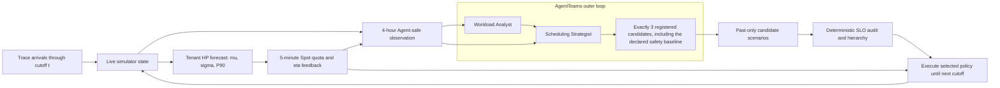

# Rolling Policy Control

SchedNav combines a history-only predictive Spot quota loop with a slower, bounded policy-selection loop. The predictor controls numeric quota; the outer controller may switch only among registered high-level policies. Neither an Agent nor a forecast model can submit a Job, Node, GPU, placement, model weight or arbitrary parameter.

This path is evaluated by chronological shadow replay. It has the information shape of an online controller, but it is not a Kubernetes, Slurm or production-cluster actuator.

## Nested control loops



The inner loop is the tenant/resource-pool predictor documented in [Predictive Spot Control](predictive-control.md):

- observe running HP demand every minute;
- train or warm-start once per day from 28 days of history;
- forecast four hourly Normal distributions;
- reserve the P90 HP quantile;
- recompute 1/2/4-hour Spot quota every five minutes;
- update bounded per-pool \(\eta\) from realized guarantee and eviction events.

The outer loop runs every four hours in V1:

1. The simulator exports current queue/allocation aggregates, carry-over descriptors, ledger counts and predictive projection. Remaining runtime and node allocation are retained only in the simulator state-handoff hash.
2. In `single_agent`, Scheduling Strategist chooses exactly three registered candidates including `observation.required_candidate_action_id`. In `multi_agent`, Workload Analyst first emits a structured workload/forecast/risk artifact; Scheduling Strategist then chooses the same fixed-size candidate set. The required action is resolved from the frozen Action Space rather than hard-coded in an Agent prompt.
3. The simulator evaluates those candidates on a cutoff-safe scenario. Agents never see an unevaluated candidate's outcome and never select the final action themselves.
4. The deterministic SLO layer removes hard-constraint failures, then applies allocation rate, Spot p95 JCT and eviction rate in that order. No weighted LLM score exists.
5. The selected high-level policy executes until the next cutoff in the same simulator session. Queue contents, allocations, remaining work, predictor state, guarantee ledger and feedback state are preserved.

Planning calls may deterministically replay an accepted decision prefix to reveal the next cutoff observation. Only the final completed replay is execution evidence; it is one continuous simulator session with exact state handoff.

## Information boundary

Deployable controllers receive only jobs submitted no later than the current cutoff. Their candidate scenarios are constructed from:

- current carry-over work, with remaining duration estimated from the median duration of jobs of the same class that completed before the cutoff;
- completed HP/Spot templates from the preceding four hours, shifted into the next four hours;
- P90 HP demand derived from the predictor's cutoff-safe forecast.

The `schednav.past-replay-scenario/v2` evaluator preserves each aggregate
P90 GPU-demand target but deterministically decomposes it into multiple HP jobs
using only HP job sizes and tenant labels visible at the cutoff. The number of
pieces is bounded, every point records its visible-template count and maximum
synthetic job size, and no future job shape is consulted. This avoids changing
an aggregate demand forecast into one cluster-sized gang job inside the
placement simulator.

The current `schednav.past-replay-scenario/v3` evaluator additionally subtracts
cutoff-visible surviving HP carry-over from the forecast before constructing
incremental arrivals, preserves every queued job's already accrued wait, and
evaluates the same three candidates on two past-only scenarios: calibrated P90
for the declared decision hierarchy and recent-history replay as a stress
tie-break only. Its observation separates one-hour, previous-hour and four-hour
workload state, live queue/SLO progress and forecast risk. The frozen v3 loop
decides every two hours and holds a changed action for at least four hours.

Actual future arrivals are not used by `workload_rule`, `single_agent` or `multi_agent`. They are revealed only as the simulator advances after the action is frozen. `posthoc-catalog-oracle` is explicitly non-deployable and is the only arm allowed to use the actual future inside candidate selection; it is reported as an upper-bound diagnostic, never as a controller.

Agent evaluation windows are also isolated from one another, and each task
exposes exactly one controller observation. Context-isolation receipts have two
accepted protocols. V1 clears a reusable Worker private room before assignment.
V2 creates a new private room for exactly one task, verifies that the Worker has
seen no message in it, sends exactly one assignment, and never reuses that room.
V2 is the formal rolling-v3 protocol from wave 05 onward because delayed Manager
completion messages can arrive after a valid `/clear` acknowledgement in a
reused room. This is an execution-transport repair only: model, prompts, visible
observation, action catalog, LLM/simulation budgets and SLO contract remain
unchanged, and all failed pre-repair wave-05 attempts are excluded.

The deterministic Simulation Agent is resumable at arm granularity. Completed
arm receipts and next-wave checkpoints are reused byte-for-byte, while only
missing arms are submitted again under their original content-derived
idempotency keys. A transient `read_artifact` HTTP 404 is retried as an
eventual-consistency condition; semantic bridge or artifact errors still fail
closed. If the local operator exits after task creation but before ledger
publication, the exact existing 15-request task is resumed instead of recreated.
Artifact reads use mcporter's compact text rendering, which remains JSON and
keeps late-wave checkpoints below the CLI output cap. A larger terminal control
report is recorded as explicitly omitted from the Simulation Agent's structured
receipt when it reaches that exact cap; the immutable full report remains in the
bridge task store for the trusted collector to hash and validate during closeout.

Both protocols write a fingerprinted `context-isolation.json` before assignment
and audit the post-dispatch Worker context against the exact assignment. The
receipt is separate from AgentTeams `meta.json` because task acknowledgement may
normalize that metadata. A project-room batch containing several holdout windows
is not acceptable evidence because an early window could otherwise inherit a
later window's summary through conversational context. The plan collector binds
the private room, task, Worker and observation fingerprint and rejects invalid
ordering or aggregated messages.

The observation carries source job identifiers for state correlation, but the Action Space and bridge expose no identifier-bearing operation. A model therefore cannot turn that information into fine-grained placement or victim selection.

## Registered action space

The registered catalog is shared by
[rolling-predictive-v1.json](../configs/action_spaces/rolling-predictive-v1.json)
and the calibrated
[rolling-predictive-v2.json](../configs/action_spaces/rolling-predictive-v2.json),
while [rolling-predictive-v3.json](../configs/action_spaces/rolling-predictive-v3.json)
uses the same bounded five-action catalog with the v3 observation/scenario
contract:

| Action | Scheduler behavior | Predictor admission gate |
|---|---|---|
| `native-fifo` | FIFO safety action | Enforced |
| `rolling-fifo-open` | FIFO | Bypassed for the interval |
| `rolling-preemptive-open-d0000` | HP-first, immediate preemption, 9% eviction budget | Bypassed |
| `rolling-preemptive-open-d0900` | HP-first, 900-second preemption delay, 9% eviction budget | Bypassed |
| `rolling-preemptive-open-loss-aware` | HP-first, lowest-checkpoint-loss victim, 9% eviction budget | Bypassed |

`bypass` does not disable forecasting, retraining or feedback. It only lets the outer controller temporarily open Spot admission when the fixed P90 gate is too conservative. Placement remains deterministic best-fit, preemption overhead remains 80 seconds, and the predictive model cannot be switched by an Agent.

The required safety action is versioned with the study. V1 required
`native-fifo`, which still enforced the predictive admission gate. V2 requires
`rolling-fifo-open`: it keeps FIFO placement and queue order but bypasses the
predictor's Spot-admission decision for that interval. This makes the rolling
safety action behaviorally comparable to ordinary FIFO while leaving forecast,
retraining and feedback state active for later decisions. `native-fifo` remains
in the five-action catalog as a guarded diagnostic; it is no longer implicitly
required. Every observation and accepted Agent plan records the resolved action
ID, so a plan bound to a different study baseline is rejected before simulation.
V3 retains `rolling-fifo-open` as the required action and adds a four-hour
minimum-hold guard to avoid two-hour policy flapping.

## Frozen comparison

The [rolling-ablation-v1 design](../configs/studies/rolling-ablation-v1.json) was content-addressed before its five chronological holdout windows were simulated. Each arm runs twice from fresh state:

| Arm | Purpose | Candidate simulations per cutoff |
|---|---|---:|
| Ordinary FIFO | Non-predictive safety baseline | 0 |
| Fixed tenant predictor | Internalized predictive loop under one fixed policy | 0 |
| Rolling workload rule | Past-only deterministic outer controller | 3 |
| Rolling single Agent | Strategist-only candidate discovery | 3 |
| Rolling multi-Agent | Analyst then Strategist through AgentTeams | 3 |
| Post-hoc catalog oracle | Non-deployable five-action upper bound | 5 |

The multi-Agent claim gate is deliberately strict. It requires no fewer hard-SLO-passing windows than every deployable comparator and a strictly better declared hierarchy outcome than both same-budget controllers. Otherwise the public result must say `not_established`.

A separate `multi_agent_vs_ordinary_gate` answers the simpler baseline question:
it is `supported` only when the declared hierarchy ranks rolling multi-Agent
strictly above ordinary FIFO. A tie is not described as an improvement, even if
the same-budget incremental multi-Agent gate passes.

The frozen [rolling-ablation-v3 design](../configs/studies/rolling-ablation-v3.json)
adds a matched-handoff causal arm. `rolling-multi-agent` and
`rolling-multi-agent-masked` each make two `deepseek-v4-flash` calls and receive
the same three-candidate/two-scenario simulation budget. Their Strategist
instruction and de-identified observation are byte-identical; the intended
direct treatment is whether the preceding Analyst's structured payload is
visible or replaced with a fixed mask. `analyst_causal_value_gate` can be
supported only if the full handoff is strictly better under the declared SLO
hierarchy and both resource counts match. Because non-Agent holdout outcomes
were visible before the prompt-equality amendment, this comparison is explicitly
exploratory rather than a fully blinded confirmatory causal claim.

## Verified five-window result

AgentTeams project `proj-20260810-062224` completed the frozen study on the five
chronological holdout days from 2024-08-16 through 2024-08-20. Each controller
kept one simulator session across six four-hour decisions, and every complete
arm/window execution ran twice from fresh state. The Agent-controlled arms
produced 90 unique, byte-hashed decision-stage receipts: 30 single-Agent
Strategist calls and 30 Analyst + 30 Strategist calls for multi-Agent. The
deterministic Simulation Agent then executed the frozen decisions against the
hidden real future.

| Arm | Hard-SLO pass | Mean allocation | Mean Spot p95 JCT | Mean eviction/run |
|---|---:|---:|---:|---:|
| Ordinary FIFO | 5/5 | 65.3543% | 48,131.73 s | 0.0000% |
| Fixed tenant predictor | 1/5 | 63.2989% | 73,470.10 s | 0.0000% |
| Rolling workload rule | 1/5 | 63.6941% | 73,396.76 s | 1.7021% |
| Rolling single Agent | 1/5 | 63.6941% | 73,396.76 s | 1.7021% |
| Rolling multi-Agent | 1/5 | 63.6941% | 73,396.76 s | 1.7021% |
| Post-hoc catalog oracle | 5/5 | 65.3543% | 48,131.73 s | 0.0000% |

The rule, single-Agent and multi-Agent controllers sometimes selected different
action sequences, but they produced identical aggregate metrics. On four days,
all three failed only `allocation-fifo-nondegradation`; they passed the other
declared hard constraints. The fixed predictor failed the same allocation gate
on the same four days. FIFO passed every evaluated day. The future-aware oracle
also returned FIFO-equivalent aggregate evidence and remains non-deployable.

An independent SLO Auditor then verified 30/30 record fingerprints, 30/30
two-repetition pairs and 15/15 deployable rolling information/state-handoff
boundaries. The Manager excluded the oracle and required a deployable arm to
pass all five windows. That left only `ordinary-fifo`, which is recorded as the
evaluated-scope fallback with production acceptance still
`approval_pending`. No production change was applied.

The result is intentionally negative about scheduling quality:

- `multi_agent_superiority_gate = not_established`;
- `multi_agent_vs_ordinary_gate = not_established`;
- multi-Agent ties the same-budget rule and single-Agent controls, and loses to
  ordinary FIFO on hard-SLO pass count.

What the run establishes is narrower but concrete: the history-only predictor,
quota feedback, bounded Agent candidate generation, hidden-future simulation,
stateful rolling execution, independent audit, Manager decision and human gate
form one executable evidence chain. It does **not** establish that adding more
Agents improves scheduling performance.

This frozen result used the earlier `schednav.past-replay-scenario/v1`
representation, which encoded one aggregate forecast point as one synthetic HP
gang job. It remains valid evidence for that implementation fingerprint and is
retained as the diagnostic result that motivated v2. It must not be mixed with
new v2 records or reused as post-fix superiority evidence.

The compact [ablation evidence](../evidence/rolling-v1/alibaba-gpu-series-2-rolling-ablation-v1.json)
has fingerprint
`68599380f0b493990adba4a58afcba11e431d84cd3b67396bcd72f4aaf5b4508`.
The separately verified [AgentTeams closeout receipt](../evidence/rolling-v1/alibaba-gpu-series-2-rolling-agentteams-closeout-v1.json)
has fingerprint
`8e25790e294f2c2f99b44e5229b6c6a5beb4167fc07aa09cb14a7559322fd47c`.

## Verified v2 evaluator result

The [rolling-ablation-v2 design](../configs/studies/rolling-ablation-v2.json)
uses a new implementation fingerprint and a separately frozen chronological
holdout from 2024-08-21 through 2024-08-25. Its candidate scenario decomposes
aggregate HP demand into cutoff-visible Job shapes, the tenant predictor's P90
correction uses only past validation residuals, and quota-starvation diagnostics
are recorded without relaxing admission. The required safety action is
`rolling-fifo-open`: it retains FIFO queue/placement behavior while bypassing
only the current interval's predictive Spot-admission gate.

All 30 arm/window records ran twice with identical repetition fingerprints.
Each deployable rolling controller consumed 90 candidate simulations; the
non-deployable five-action oracle consumed 150.

| Arm | Hard-SLO pass | Mean allocation | Mean Spot p95 JCT | Mean eviction/run |
|---|---:|---:|---:|---:|
| Ordinary FIFO | 4/5 | 70.9875% | 35,722.03 s | 0.0000% |
| Fixed tenant predictor | 2/5 | 70.0856% | 40,739.40 s | 0.0000% |
| Rolling workload rule | 4/5 | 70.9875% | 35,722.03 s | 0.0000% |
| Rolling single Agent | 4/5 | 70.9875% | 35,722.03 s | 0.0000% |
| Rolling multi-Agent | 4/5 | 70.9875% | 35,722.03 s | 0.0000% |
| Post-hoc catalog oracle | 4/5 | 70.9875% | 35,722.03 s | 0.0000% |

The multi-Agent arm ranks above fixed prediction by hard-SLO pass count, but it
ties ordinary FIFO, the same-budget rule and the single-Agent controller under
the declared hierarchy. The post-hoc oracle also ties and remains
non-deployable. Consequently both formal gates remain `not_established`.
The AgentTeams plan set contains the required 30 single-Agent stages and 60
multi-Agent stages plus two honestly retained correction/retry calls, so the
aggregate LLM call counts are 31 and 61 rather than being normalized back to
their minimums. Token counts were unavailable and are not fabricated.

The compact [v2 ablation evidence](../evidence/rolling-v2/alibaba-gpu-series-2-rolling-ablation-v2.json)
has fingerprint
`9a3359184460af16de5a3fcbad44e59fca7d1fca6af7bc8fb9b0154c97ef665e`.

AgentTeams project `proj-20260811-042605` completed the corresponding
orchestration chain with every LLM stage fixed to `deepseek-v4-flash`. Its ten
controllers produced 90 isolated normalized planning stages across six
cutoffs. At the terminal cutoff, task `task-20260811-212000` reused the ten
already-successful bridge results and emitted ten terminal receipts plus one
summary without replaying simulation: `advance_rolling_policy_call_count=0`,
`succeeded=10`, and no wave-07 checkpoint was created. The earlier generic
runner task remains recorded as blocked because its pre-terminal contract
incorrectly required a next-window checkpoint; it is not treated as execution
evidence or silently rewritten.

SLO Auditor task `task-20260811-214000` independently verified 30/30 record
fingerprints, 30/30 deterministic repetitions and 15/15 rolling boundaries.
Manager task `task-20260811-214100` then excluded the future-aware oracle and
required an arm to pass all five windows. Since every deployable arm passed at
most four, the eligible set is empty and `recommended_arm_id` is `null`.
Production remains `approval_pending` and no change was applied. The verified
[v2 AgentTeams closeout](../evidence/rolling-v2/alibaba-gpu-series-2-rolling-agentteams-closeout-v2.json)
has fingerprint
`a4f2c009200863c7845f5c45efef1aaf105819dc2d88ae10b3dbab718944db35`.

## Verified v3 matched-handoff result

The separately frozen 2024-08-26 through 2024-08-30 study uses 12 two-hour
decisions per controller, a four-hour minimum action hold, cutoff-visible carry
over, and the dual past-only candidate scenarios described above. Fifteen
Agent controllers completed the five windows in single-Agent, full multi-Agent
and masked multi-Agent modes. The accepted plan set contains 300 byte-verified
`deepseek-v4-flash` stages: 60 single-Agent Strategist calls, 60 full Analyst +
60 full Strategist calls, and 60 masked Analyst + 60 masked Strategist calls.

All 35 arm/window records contain two identical deterministic repetitions:

| Arm | Hard-SLO pass | Mean allocation | Mean Spot p95 JCT | Mean eviction/run |
|---|---:|---:|---:|---:|
| Ordinary FIFO | 5/5 | 69.1728% | 33,987.52 s | 0.0000% |
| Fixed tenant predictor | 2/5 | 68.7648% | 36,901.89 s | 1.1940% |
| Rolling workload rule | 4/5 | 69.1669% | 34,035.48 s | 2.3953% |
| Rolling single Agent | 3/5 | 69.1657% | 33,987.52 s | 1.3953% |
| Rolling multi-Agent | 3/5 | 69.1657% | 33,987.52 s | 1.3953% |
| Rolling multi-Agent, masked Analyst | 4/5 | 69.1669% | 34,035.48 s | 2.3953% |
| Post-hoc catalog oracle | 5/5 | 69.1728% | 33,987.52 s | 0.0000% |

The full multi-Agent arm ties the single-Agent arm exactly and passes fewer
windows than both the deterministic workload rule and the matched masked
handoff. Full and masked multi-Agent each consumed 120 accepted model calls,
360 candidate simulations and five windows, so resource mismatch cannot
explain that comparison. The declared pairwise hierarchy ranks the full
Analyst handoff `worse`; consequently all three gates are
`not_established`: incremental multi-Agent superiority, multi-Agent versus
ordinary FIFO, and Analyst causal value.

SLO Auditor task `task-v3-20260813-closeout-audit` independently verified all
35 record fingerprints, all 35 repetition pairs, all 20 rolling arm/window
chains, aggregate metrics, pass counts and matched-resource fields. Manager
task `task-v3-20260813-closeout-manager` excluded the future-aware oracle and
found only `ordinary-fifo` eligible at 5/5. It recommends FIFO solely as the
evaluated-scope fallback, retains `approval_pending`, and applies no production
change. Two congested Manager-room dispatches produced no stage artifact; the
sole accepted Manager output ran after service restart in a fresh one-use room,
and that recovery is recorded in the task isolation receipt.

The compact [v3 ablation evidence](../evidence/rolling-v3/alibaba-gpu-series-2-rolling-ablation-v3.json)
has fingerprint
`ccb6ec30822da0dfe54382aeff27815754d371e33c6f6dac22d5f266e047fd15`.
The verified [v3 AgentTeams closeout](../evidence/rolling-v3/alibaba-gpu-series-2-rolling-agentteams-closeout-v3.json)
has fingerprint
`72b5c4435504bba2f238198dedc244e12cf351abb5fea05e8f4eb9487524d6c6`.
Because non-Agent holdout outcomes were visible before the prompt-equality
amendment, the full-versus-masked result is labeled exploratory matched-handoff
evidence, not a fully blinded confirmatory causal trial.

## Reproduction

Raw and per-job data are not committed. Prepare the exact frozen traces from a local Alibaba dataset checkout:

```powershell
$env:PYTHONPATH = (Resolve-Path .\src).Path
.\.venv\Scripts\python.exe .\scripts\prepare_rolling_ablation.py `
  --dataset-directory C:\datasets\cluster-trace-v2026-spot-gpu
```

The preparation command verifies both raw-file hashes and all ten expected canonical Trace fingerprints. Run deterministic controls first:

```powershell
.\.venv\Scripts\python.exe .\scripts\run_rolling_ablation.py --phase non-agent
```

After an AgentTeams project has completed every rolling arm, export that project's
`shared/tasks/<task-id>/` directories to a local ignored directory. The collector
does not trust receipt strings alone: it recomputes the byte SHA-256 of every
`normalized-stage-*.json` and checks the AgentTeams task, Worker, role, model and
observation identity, plus private-room single-observation context isolation,
before accepting a plan. Then collect only validated,
fingerprint-bound plans:

For executions split across parallel deterministic bridge lanes, repeat
`--bridge-task-root` once per lane. The collector treats those roots as one
read-only evidence set and rejects duplicate controller IDs.

If an AgentTeams task metadata file has the historical serializer's exact
trailing literal `\\n` anomaly, the collector parses the JSON object without
rewriting the source bytes and lists every affected task ID under
`source_anomalies` in the fingerprinted plan-set manifest. Other malformed JSON
still fails closed.

```powershell
.\.venv\Scripts\python.exe .\scripts\collect_agentteams_rolling_plans.py `
  --project-id <agentteams-project-id> `
  --agentteams-task-root artifacts\agentteams-rolling-tasks\<agentteams-project-id>\tasks `
  --output-dir artifacts\rolling-agent-plans\<agentteams-project-id>

.\.venv\Scripts\python.exe .\scripts\run_rolling_ablation.py `
  --phase agent `
  --plans-dir artifacts\rolling-agent-plans\<agentteams-project-id>
```

Independent holdout windows may be replayed in separate OS processes with
`--window-id <id> --defer-summary`; each process writes only that window's
disjoint record directories. After every worker succeeds, run
`--phase summarize` once to verify and aggregate the complete record set. This
changes wall-clock parallelism only, not simulator or decision semantics.

Generated traces, full simulator results, model conversations and AgentTeams rooms remain local. The repository publishes only compact aggregate evidence and content fingerprints.

After exporting the final Auditor and Manager task directories, validate their
byte receipts and publish the closeout record with:

```powershell
.\.venv\Scripts\python.exe .\scripts\publish_rolling_agentteams_closeout.py `
  --project-id <agentteams-project-id> `
  --task-root artifacts\agentteams-rolling-tasks\<agentteams-project-id>\tasks `
  --audit-task-id <audit-task-id> `
  --manager-task-id <manager-task-id>
```

The closeout verifier derives record, deterministic-repetition and rolling-arm
counts from the supplied compact evidence. It therefore preserves the published
v1/v2 30-record and 15-rolling-arm checks while validating v3's 35 records and
20 rolling arm/window chains. When causal-ablation fields are present, Auditor
and Manager outputs must also reproduce the Analyst gate, pairwise result and
matched-resource receipt exactly.

## Current limits

- Historical hidden-future replay validates decision causality, not production reliability.
- Candidate scenarios use a declared past-template/carry-over approximation; v2 removes the cluster-sized synthetic gang-job artifact, but forecast calibration and duration/arrival-shape error can still select a poor action. Hidden-future evaluation records that error rather than repairing it retrospectively.
- Five holdout days provide a controlled demonstration, not a universal scheduling result or statistical proof across every cluster.
- The current candidate scenarios and outer selection logic did not beat FIFO;
  improved forecasting/calibration or a stronger past-only candidate evaluator
  is required before any Agent scheduling-superiority claim can pass.
- Process-restart recovery of a live simulator, persistent model serving, telemetry ingestion, actuator rollback and cluster failure handling remain future work.
